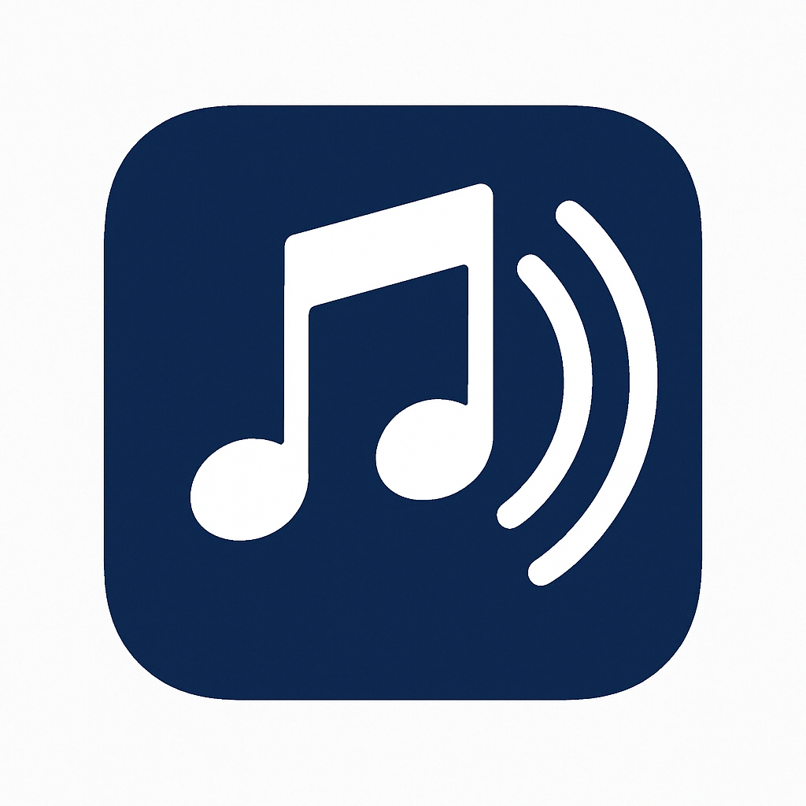

# Android Music Player

A modern, feature-rich music player for Android that provides a seamless music listening experience with a beautiful Material Design interface.



## Features

### Music Playback
- 🎵 Play local audio files from your device
- ⏯️ Basic playback controls (play, pause, skip, previous)
- 🎨 Beautiful album art display
- 🔄 Background playback support
- 📱 Media style notification with playback controls

### Library Management
- 📚 Browse music by albums and songs
- 🗂️ Album view with detailed song listings
- 🔍 Easy navigation between albums and songs
- 📋 Song and album information display

### User Interface
- 🎨 Modern Material Design interface
- 💫 Smooth animations and transitions
- 🌙 Persistent player controls at the bottom
- 📱 Responsive layout for all screen sizes
- 🎵 Media style notification for background playback

### File Management
- 🗑️ Delete songs directly from the app
- 📤 Share songs with other apps
- 📂 Proper media store integration
- 🔒 Runtime permission handling

## Technical Details

### Requirements
- Android 7.0 (API level 24) or higher
- Storage permission for accessing music files
- Notification permission for media controls

### Libraries Used
- AndroidX Core and AppCompat
- Material Design Components
- Glide for image loading
- MediaPlayer for audio playback
- MediaStyle notifications
- CardView for UI components

### Architecture
- Singleton pattern for MediaPlayer management
- Service-based background playback
- Event-driven UI updates
- Content Provider integration for media access

## Setup Instructions

1. Clone the repository:
```bash
git clone https://github.com/yourusername/MusicPlayerNew.git
```

2. Open the project in Android Studio

3. Build and run the application

4. Grant the necessary permissions when prompted:
   - Storage access for music files
   - Notification permission for media controls

## Usage

1. **Main Screen**
   - Browse your music library
   - View all songs and albums
   - Quick access to recently played songs

2. **Album View**
   - See all songs in an album
   - View album artwork and details
   - Play entire albums

3. **Player Controls**
   - Persistent controls at screen bottom
   - Swipe up for full player view
   - Background playback with notification controls

4. **File Management**
   - Long press on songs for options
   - Share or delete songs
   - Manage your music library

## Contributing

Contributions are welcome! Please feel free to submit a Pull Request.

## License

This project is licensed under the MIT License - see the [LICENSE](LICENSE) file for details.

## Acknowledgments

- Material Design guidelines for UI inspiration
- Android documentation for media playback best practices
- Open source community for various libraries used

## Contact

For any queries or suggestions, please open an issue in the repository.

---
Made with ❤️ by [Kevin] 